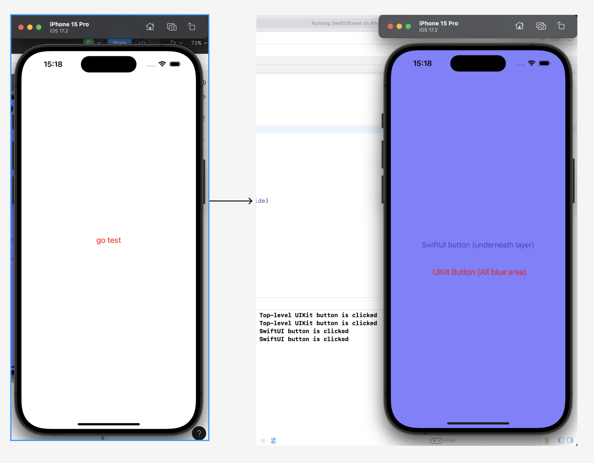
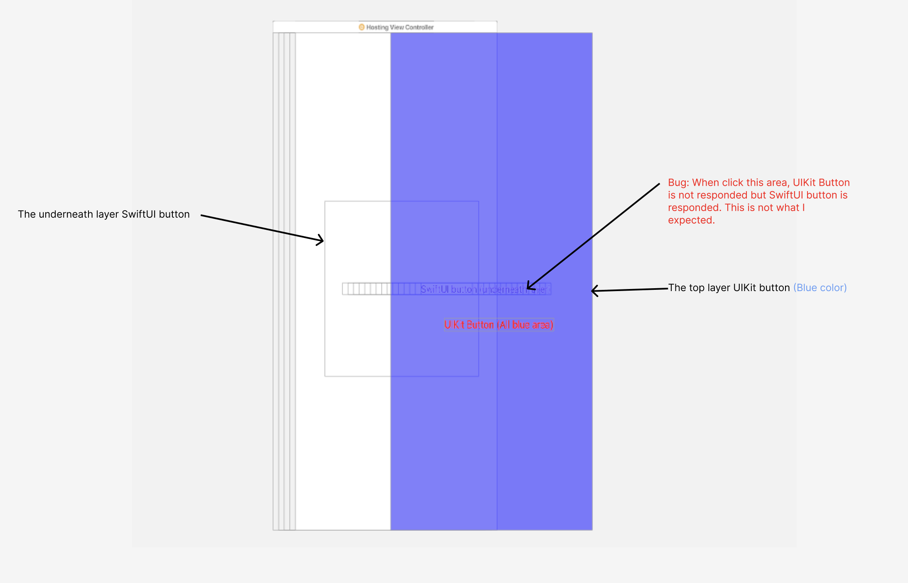

# Issue

Our project mixes UIKit and SwiftUI, (UIButton is added into UIHostingController). The issue is when we clicked the top layer UIKit button, the underneath layer SwiftUI button is responded, but the UIKit button doesn't be responded.

# Screenshots

Steps to find this issue:
1. Click `go test` button.
2. Click SwiftUI button area on UIKit button.

# Layouts

